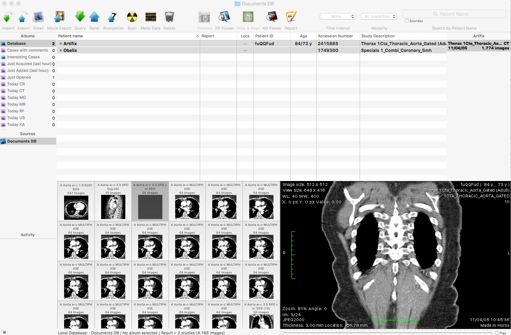
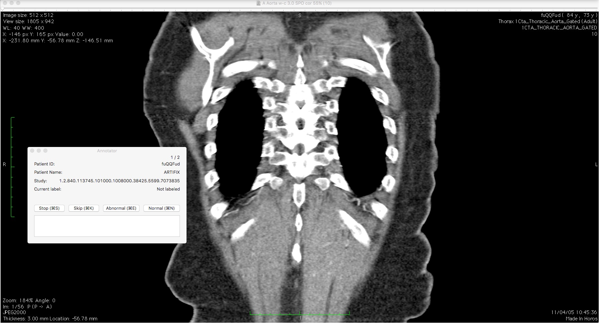

#Anno

###OsiriX/Horos plugin to annotate medical imaging studies

This is a [OsiriX](https://github.com/pixmeo)/[Horos](https://github.com/horosproject) plugin that allows you to quickly annotate medical images as normal/abnormal and add comments. The goal of this project was to explore writing plugins for the OsiriX/Horos medical image viewer. I've published a more elaborate writeup in this [blogpost](https://medium.com). Other good resources are available [here](https://osirixpluginbasics.wordpress.com/).

###Usage

You need to have a recent version of XCode installed, as well as either the OsiriX or Horos medical image viewer.

Clone the repository and open Anno.xcodeproj in XCode. Build Anno. Under Products, a file called Anno.osirixplugin will appear, right click on that file and show it in Finder. Next, open it with the medical image viewer of your choice, and install the plugin. In case you don't have any studies available to annotate, I've included some [sample DICOM data](sample_data). You could also download example studies [here](http://www.osirix-viewer.com/datasets/).

If you want to use the plugin to annotate several patients in one sitting, you need to select all of those patients, and open them all at once. You can do this by double clicking on the top patient, but it doesn't always work. A good way to check if you opened up all patients is looking at the patient browser to see if they are all still selected after the viewer opened up.

Next, find the Anno plugin under the Plugin menu, and open it. The plugin will either make a new json file that it will start writing annotations to, or continue writing to an old file.
Use of the plugin should be self explanatory from here on out.

