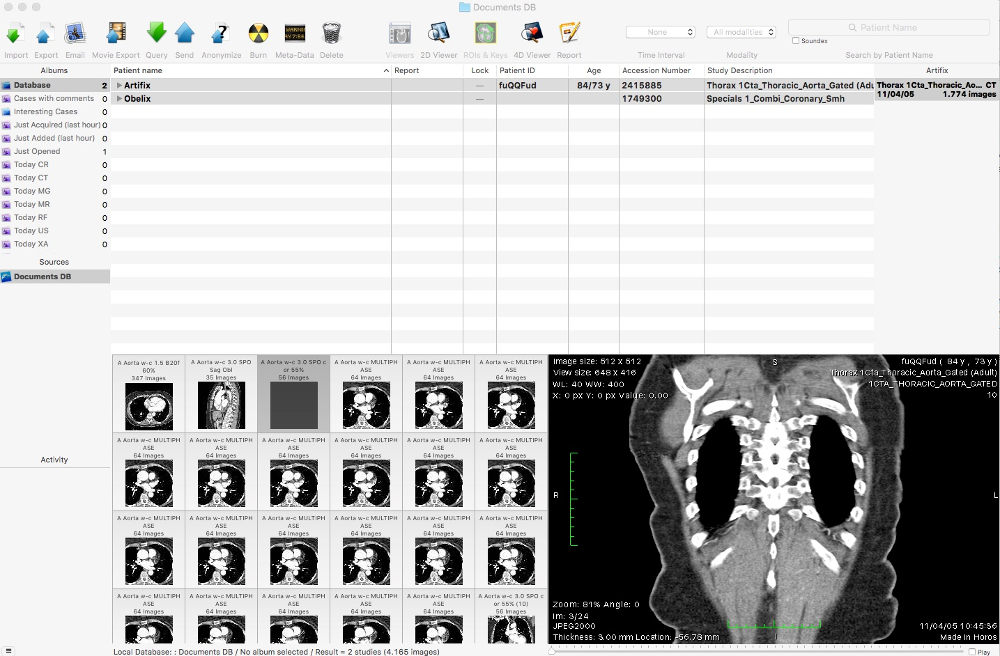
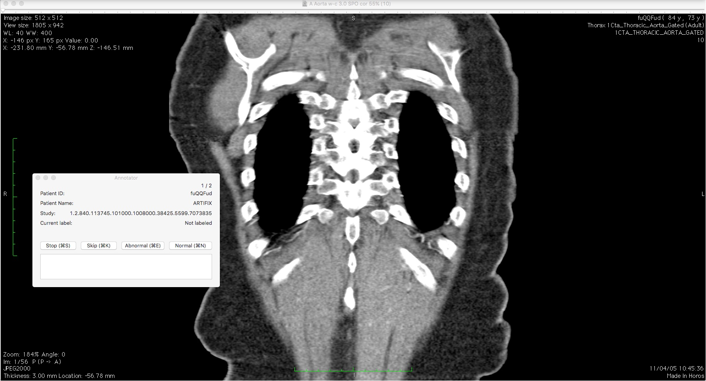

#Annotating medical imaging data: development of a OsiriX/Horos plugin

In recent years, convolutional neural networks have reached (super-)human level [capability](https://arxiv.org/pdf/1502.01852.pdf) on certain computer vision tasks. A lot of researchers and companies are interested in leveraging this deep learning revolution to build software that assists radiologists in interpreting medical images.

[IBM Watson](https://www.technologyreview.com/s/600706/ibms-automated-radiologist-can-read-images-and-medical-records/) has been working on a very ambitious holistic approach to apply machine learning solutions to clinical care. In 2015, they acquired [Merge Healthcare](http://www.bloomberg.com/news/articles/2015-08-06/ibm-to-buy-merge-for-1-billion-for-medical-imaging-technology), thereby securing access to vast amounts of medical data. Similarly, [Enlitic](https://www.crunchbase.com/organization/enlitic#/entity) partnered with [Capitol Health](http://venturebeat.com/2015/10/27/deep-learning-startup-enlitic-raises-10m-from-radiology-company-capitol-health/), so they can train deep networks on their data archives. Over 10 other incumbents and startups are working on related projects. Some of these have access to a lot of medical data, others don't. But even if a company has access to a lot of radiology images, these images are usually not annotated yet. Annotation can be a very costly and time consuming process, since you need human experts to go over the images and annotate them. Furthermore, you need specialized software that can handle [DICOM](http://dicom.nema.org/standard.html) images. 

I decided it would be interesting to explore the technologies involved, and so I wrote an annotation plugin for the [OsiriX](https://github.com/pixmeo)/[Horos](https://github.com/horosproject) medical image viewer. This is by no means a finished product, it only allows for classifying DICOMs as normal or abnormal. But I hope it might be helpful for people who want to learn how to build their own annotation plugins. Other good resources to that end can be found [here](https://osirixpluginbasics.wordpress.com/).

###Usage

You need to have a recent version of XCode installed, as well as either the OsiriX or Horos medical image viewer.

Clone the repository and open Anno.xcodeproj in XCode. Build Anno. Under Products, a file called Anno.osirixplugin will appear, right click on that file and show it in Finder. Next, open it with the medical image viewer of your choice, and install the plugin. In case you don't have any studies available to annotate, I've included some [sample DICOM data](sample_data). You could also download example studies [here](http://www.osirix-viewer.com/datasets/).

If you want to use the plugin to annotate several patients in one sitting, you need to select all of those patients, and open them all at once. You can do this by double clicking on the top patient, but it doesn't always work. A good way to check if you opened up all patients is looking at the patient browser to see if they are all still selected after the viewer opened up.

Next, find the Anno plugin under the Plugin menu, and open it. The plugin will either make a new json file that it will start writing annotations to, or continue writing to an old file.
Use of the plugin should be self explanatory from here on out.

